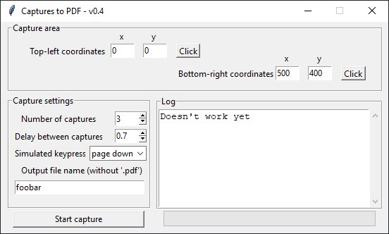

# captures-to-pdf

Little Python program to automate the capture of a sequence of screenshots and generate a unique output PDF.

**Please note:** _as of v0.2, the program simulates the PageDown keypress between each capture. In future releases it will be possible to select which keypress has to be simulated, plus the delay (currently 1 second)_

